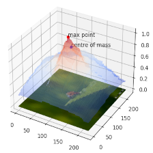

# ReX: Causal Responsibility Explanations for image classifiers

<picture>
 <source media="(prefers-color-scheme: dark)" srcset="assets/rex_logo.png">
 <source media="(prefers-color-scheme: light)" srcset="assets/rex_logo.png">
 
</picture>

<!--- BADGES: START --->

[](https://rex-xai.readthedocs.io/en/latest/)
[](https://github.com/ReX-XAI/ReX/actions/workflows/build-and-test-python-package.yml)
[](https://github.com/ReX-XAI/ReX.jl/blob/main/LICENSE)

<!--- BADGES: END --->

***

ReX is a causal explainability tool for image classifiers.

Given an input image and a classifier, ReX calculates a responsibility map across the data and identifies a minimal explanation.

  

ReX is black-box, that is, agnostic to the internal structure of the classifier.
We assume that we can modify the inputs and send them to the classifier, observing the output.
ReX outperforms other tools on single explanations, non-contiguous explanations (for partially obscured images), and multiple explanations.

For background information and detailed usage instructions, see our [documentation](https://rex-xai.readthedocs.io/en/latest/).

<!--inclusion-marker-start-do-not-remove-->

## Installation

Clone this repository and `cd` into it.

```bash
git clone git@github.com:ReX-XAI/ReX.git
cd ReX/
```

We recommend creating a virtual environment to install ReX.
ReX has been tested using versions of Python >= 3.10.
The following instructions assume `conda`:

```bash
conda create -n rex python=3.12
conda activate rex
pip install .
```

This should install an executable `rex` in your path.

> **Note:**
>
> By default, `onnxruntime` will be installed.
> If you wish to use a GPU, you should uninstall `onnxruntime` and install `onnxruntime-gpu` instead.
> You can alternatively edit the `pyproject.toml` to read "onnxruntime-gpu >= 1.17.0" rather than "onnxruntime >= 1.17.0".

<!--inclusion-marker-end-do-not-remove-->

## How to Contribute

Your contributions are highly valued and welcomed. To get started, please review the guidelines outlined in the [CONTRIBUTING.md](/CONTRIBUTING.md) file. We look forward to your participation!
