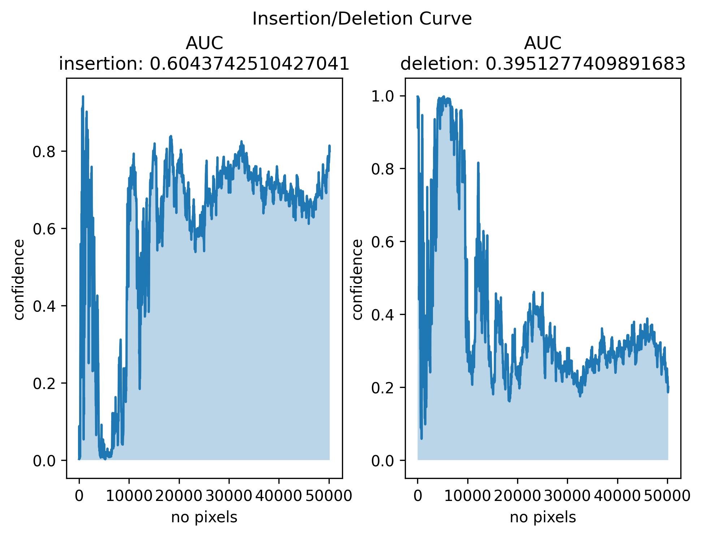

# ReX: Causal Responsibility Explanations for image classifiers

<picture>
 <source media="(prefers-color-scheme: dark)" srcset="assets/rex_logo.png">
 <source media="(prefers-color-scheme: light)" srcset="assets/rex_logo.png">
 
</picture>

<!--- BADGES: START --->
[](https://github.com/kellino/ReX/actions/workflows/ci-pipeline.yml)
[](https://github.com/kellino/ReX.jl/blob/main/LICENSE)
<!--- BADGES: END --->
<hr/>

# Setup

The following instructions assume ```conda```

``` bash
conda create -n rex python=3.10
conda activate rex
pip install .
```

onnxruntime-gpu can cause problems. Either install it manually or edit the pyproject.toml to read "onnxruntime >= 1.17.0" rather than 
"onnxruntime-gpu >= 1.17.0"

This should install an executable ```rex``` in your path.

# Simple Usage

``` bash
# with spatial search (the default)
rex <path_to_image> --model <path_to_model> 

# with linear search
rex <path_to_image> --model <path_to_model> --strategy linear

# to save the extracted explanation
rex <path_to_image> --model <path_to_model> --output <path_and_extension>

# to view an interactive responsibility landscape
rex <path_to_image> --model <path_to_model>  --surface 

# to save a responsibility landscape
rex <path_to_image> --model <path_to_model>  --surface <path_and_extension>

# to run multiple explanations
rex <path_to_image> --model <path_to_model> --strategy multi
```

# Database
To store all output in a sqlite database, use 

``` bash
rex <path_to_image> --model <path_to_model> -db <name_of_db_and_extension>
```

ReX will create the db if it does not already exist. It will append to any db with the given name, so be careful not to use the same database if you are
restarting an experiment.

# Config
ReX looks for the config file <rex.toml> in the current working directory and then ```$HOME/.config/rex.toml``` on unix-like systems.

If you want to use a custom location, use 

``` bash
rex <path_to_image> --model <path_to_model> --config <path_to_config>
```

An example config file is included in the repo as ```example.rex.toml```. Rename this to ```rex.toml``` if you wish to use it. 


# Command line usage

```
usage: ReX [-h] [--output OUTPUT] [-c CONFIG] [--batch] [--processed] [--process_script PROCESS_SCRIPT] [-v] [--surface [SURFACE]]
           [--contour [CONTOUR]] [--heatmap [HEATMAP]] [--targets TARGETS [TARGETS ...]] [--model MODEL] [--dims DIMS DIMS] [--strategy STRATEGY]
           [--database DATABASE] [--iters ITERS] [--predictions PREDICTIONS] [--thorough] [--analyze] [--analyse] [--show-all]
           filename

Explaining AI through causal reasoning

positional arguments:
  filename              file to be processed, assumes that file is 3 channel (RGB or BRG)

options:
  -h, --help            show this help message and exit
  --output OUTPUT       save explanation to <output>. Requires a cv2 compatible file extension
  -c CONFIG, --config CONFIG
                        config file to use for rex
  --batch               send batched calls to the model
  --processed           don't perform any processing with rex itself
  --process_script PROCESS_SCRIPT
                        preprocessing script
  -v, --verbose         verbosity level, either -v or -vv
  --surface [SURFACE]   surface plot, optionally saved to <SURFACE>
  --contour [CONTOUR]   contour plot, optionally saved to <CONTOUR>
  --heatmap [HEATMAP]   heatmap plot, optionally saved to <HEATMAP>
  --targets TARGETS [TARGETS ...]
                        optional label(s) to use as ground truth
  --model MODEL         model, must be tensorflow or onnx compatible
  --dims DIMS DIMS      image dimensions for resizing
  --strategy STRATEGY, -s STRATEGY
                        explanation strategy, one of < multi | spatial | linear | spotlight >
  --database DATABASE, -db DATABASE
                        store output in sqlite database <DATABASE>, creating db if necessary
  --iters ITERS         manually override the number of iterations set in the config file
  --predictions PREDICTIONS 
                        manually overrride the number of subpredictions to consider when generating responsibility maps
  --thorough            if no_predictions is greater than 1, this follows each prediction to create a complete responsibility map
  --analyze             calculate insertion/deletion curves
  --analyse             calculate insertion/deletion curves
  --show-all            produce a complete breakdown of the image

```

# Overriding the config

Some options from the config file can be overridden at the command line when calling ReX. In particular, you
can change the number of iterations of the algorithm

``` bash
rex <path_to_image> --model <path_to_model>  --iters 5
```

# Preprocessing

ReX by default tries to make reasonable guesses for image preprocessing. If the image has already been resized appropriately for the model, then
use the processed flag

``` bash
rex <path_to_image> --model <path_to_model> --processed
```

ReX will still normalize the image and convert it into a numpy array. In the event the the model input is single channel and the image is multi-channel, then ReX will try to convert the image to greyscale. If you want to avoid this, then pass in a greyscale image. 

## Preprocess Script

If you have very specific requirements for preprocessing, you can write a standalone function, ```preprocess(array)``` which ReX will try to load dynamically and call

``` bash
rex <path_to_image> --model <path_to_model> --process_script <path_to_script.py>
```

An example is included in ```scripts/example_preprocess.py```

# Explanation

An explanation for a ladybird. This explanation was produced with 20 iterations, using the default masking colour (0). The minimal, sufficient explanation itself
is pretty printed using the settings in ```[rex.visual]``` in ```rex.toml```

  

Setting ```raw = true``` in ```rex.toml``` produces the image which was actually classified by the model.


# Multiple Explanations

``` bash
rex imgs/peacock.jpg --model resnet50-v1-7.onnx --strategy multi --output peacock.png
```

The number of explanations found depends on the model and some of the settings in ```rex.toml```
    

# Occluded Images


# Explanation Quality

``` bash
rex imgs/ladybird.jpg --model resnet50-v1-7.onnx --analyse
```




# Submaps
``` bash
rex imgs/lizard.jpg --model resnet50-v1-7.onnx --predictions 5 --surface lizard_subs.png
```


# How to Contribute

Your contributions are highly valued and welcomed. To get started, please review the guidelines outlined in the [CONTRIBUTING.md](/CONTRIBUTING.md) file. We look forward to your participation!
