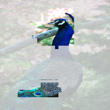
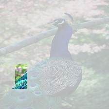

# ReX: Causal Responsibility Explanations for image classifiers

<picture>
 <source media="(prefers-color-scheme: dark)" srcset="assets/rex_logo.png">
 <source media="(prefers-color-scheme: light)" srcset="assets/rex_logo.png">
 
</picture>

<!--- BADGES: START --->

[](https://rex-xai.readthedocs.io/en/latest/)git s
[](https://github.com/ReX-XAI/ReX/actions/workflows/python-package.yml)
[](https://github.com/ReX-XAI/ReX.jl/blob/main/LICENSE)

<!--- BADGES: END --->

***

<!--inclusion-marker-start-do-not-remove-->

## Installation

Clone this repository and `cd` into it.

```bash
git clone git@github.com:ReX-XAI/ReX.git
cd ReX/
```

We recommend creating a virtual environment to install ReX.
ReX has been tested using versions of Python >= 3.10.
The following instructions assume `conda`:

```bash
conda create -n rex python=3.12
conda activate rex
pip install .
```

This should install an executable `rex` in your path.

> **Note:**
>
> By default, `onnxruntime` will be installed.
> If you wish to use a GPU, you should uninstall `onnxruntime` and install `onnxruntime-gpu` instead.
> You can alternatively edit the `pyproject.toml` to read "onnxruntime-gpu >= 1.17.0" rather than "onnxruntime >= 1.17.0".

## Quickstart

ReX requires as input an image and a model.
ReX natively understands onnx files. Train or download a model (e.g. [Resnet50](https://github.com/onnx/models/blob/main/validated/vision/classification/resnet/model/resnet50-v1-7.onnx)) and, from this directory, run:

```bash
rex imgs/dog.jpg --model resnet50-v1-7.onnx -vv --output dog_exp.jpg
```

To view an interactive plot for the responsibility map, run::

```bash
rex imgs/dog.jpg --model resnet50-v1-7.onnx -vv --surface
```

For detailed usage instructions, see our [documentation](https://rex-xai.readthedocs.io/en/latest/).

Other options:

```bash
# with spatial search (the default)
rex <path_to_image> --model <path_to_model>

# with linear search
rex <path_to_image> --model <path_to_model> --strategy linear

# to save the extracted explanation
rex <path_to_image> --model <path_to_model> --output <path_and_extension>

# to view an interactive responsibility landscape
rex <path_to_image> --model <path_to_model>  --surface

# to save a responsibility landscape
rex <path_to_image> --model <path_to_model>  --surface <path_and_extension>

# to run multiple explanations
rex <path_to_image> --model <path_to_model> --strategy multi
```

ReX configuration is mainly handled via a config file; some options can also be set on the command line.
ReX looks for the config file ``rex.toml`` in the current working directory and then ``$HOME/.config/rex.toml`` on unix-like systems.

If you want to use a custom location, use::

```bash
rex <path_to_image> --model <path_to_model> --config <path_to_config>
```

An example config file is included in the repo as ``example.rex.toml``.
Rename this to ``rex.toml`` if you wish to use it.

<!--inclusion-marker-end-do-not-remove-->

## Command line usage

```bash
usage: ReX [-h] [--output [OUTPUT]] [-c CONFIG] [--processed]
           [--script SCRIPT] [-v] [--surface [SURFACE]] [--heatmap [HEATMAP]]
           [--model MODEL] [--strategy STRATEGY] [--database DATABASE]
           [--iters ITERS] [--analyze] [--analyse] [--show-all] [--mode MODE]
           filename

Explaining AI through causal reasoning

positional arguments:
  filename              file to be processed, assumes that file is 3 channel
                        (RGB or BRG)

options:
  -h, --help            show this help message and exit
  --output [OUTPUT]     show minimal explanation, optionally saved to
                        <OUTPUT>. Requires a PIL compatible file extension
  -c CONFIG, --config CONFIG
                        config file to use for rex
  --processed           don't perform any processing with rex itself
  --script SCRIPT       custom loading and preprocessing script, for us with pytorch
  -v, --verbose         verbosity level, either -v or -vv, or -vvv
  --surface [SURFACE]   surface plot, optionally saved to <SURFACE>
  --heatmap [HEATMAP]   heatmap plot, optionally saved to <HEATMAP>
  --model MODEL         model, must be onnx format
  --strategy STRATEGY, -s STRATEGY
                        explanation strategy, one of < multi | spatial |
                        linear | spotlight >
  --database DATABASE, -db DATABASE
                        store output in sqlite database <DATABASE>, creating
                        db if necessary
  --iters ITERS         manually override the number of iterations set in the
                        config file
  --analyze             area, entropy different and insertion/deletion curves
  --analyse             area, entropy different and insertion/deletion curves
  --mode MODE, -m MODE  assist ReX with your input type, one of <tabular>,
                        <spectral>, <RGB>, <L>

```

## Examples

### Explanation

An explanation for a ladybird. This explanation was produced with 20 iterations, using the default masking colour (0). The minimal, sufficient explanation itself
is pretty printed using the settings in `[rex.visual]` in `rex.toml`

  

Setting `raw = true` in `rex.toml` produces the image which was actually classified by the model.


### Multiple Explanations

```bash
rex imgs/peacock.jpg --model resnet50-v1-7.onnx --strategy multi --output peacock.png
```

The number of explanations found depends on the model and some of the settings in `rex.toml`
   

### Occluded Images


### Explanation Quality

```bash
rex imgs/ladybird.jpg --script scripts/pytorch.py --analyse

INFO:ReX:area 0.000399, entropy difference 6.751189, insertion curve 0.964960, deletion curve 0.046096
```

### Submaps

```bash
rex imgs/lizard.jpg --model resnet50-v1-7.onnx --predictions 5 --surface lizard_subs.png
```


## How to Contribute

Your contributions are highly valued and welcomed. To get started, please review the guidelines outlined in the [CONTRIBUTING.md](/CONTRIBUTING.md) file. We look forward to your participation!
