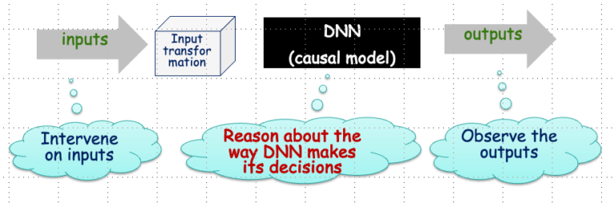

# Background information

ReX is a causal explainability tool for image classifiers.
ReX is black-box, that is, agnostic to the internal structure of the classifier.
We assume that we can modify the inputs and send them to the classifier, observing the output.
ReX outperforms other tools on [single explanations](https://www.hanachockler.com/eccv/), [non-contiguous explanations](https://www.hanachockler.com/iccv2021/) (for partially obscured images), and [multiple explanations](http://www.hanachockler.com/multirex/).

## Assumptions

ReX works on the assumption that if we can intervene on the inputs to a model and observe changes in its outputs, we can use this information to reason about the way the DNN makes its decisions.

## Presentations about ReX

* [Attacking your black box classifier with ReX](https://www.hanachockler.com/rex-2/)
* [Causal Explanations For Image Classifiers](https://www.hanachockler.com/hana-chockler-causal-xai-workshop-102023/)

## Papers

1. [Causal Explanations for Image Classifiers](https://arxiv.org/pdf/2411.08875). Under review. This paper introduces the tool ReX.
2. [Multiple Different Black Box Explanations for Image Classifiers](http://www.hanachockler.com/multirex/). Under review. This paper introduces MULTI-ReX for multiple explanations.
3. [3D ReX: Causal Explanations in 3D Neuroimaging Classification](https://arxiv.org/pdf/2502.12181). Presented at [Imageomics-AAAI-25](https://sites.google.com/view/imageomics-aaai-25/home?authuser=0). 3D explanations for neuroimaging.
4. [Explanations for Occluded Images](http://www.hanachockler.com/iccv2021/). In ICCV’21. This paper introduces causality for image classifier explanations. Note: the tool is called DC-Causal in this paper.
5. [Explaining Image Classifiers using Statistical Fault Localization](http://www.hanachockler.com/eccv/). In ECCV’20. The first paper on ReX. Note: the tool is called DeepCover in this paper.
