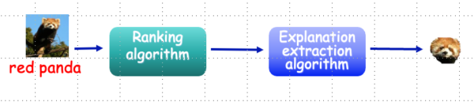
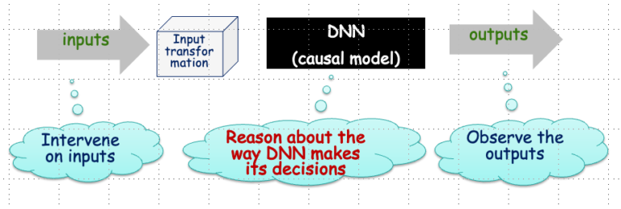

# Background information

ReX is a causal explainability tool for image classifiers.
ReX is black-box, that is, agnostic to the internal structure of the classifier.
We assume that we can modify the inputs and send them to the classifier, observing the output.
ReX outperforms other tools on [single explanations](https://www.hanachockler.com/eccv/), [non-contiguous explanations](https://www.hanachockler.com/iccv2021/) (for partially obscured images), and [multiple explanations](http://www.hanachockler.com/multirex/).

## Assumptions

ReX works on the assumption that if we can intervene on the inputs to a model and observe changes in its outputs, we can use this information to reason about the way the DNN makes its decisions.

## Presentations about ReX

* [Attacking your black box classifier with ReX](https://www.hanachockler.com/rex-2/)
* [Causal Explanations For Image Classifiers](https://www.hanachockler.com/hana-chockler-causal-xai-workshop-102023/)

## Papers

1. [Causal Explanations for Image Classifiers](https://arxiv.org/pdf/2411.08875). Under review. This paper introduces the tool ReX.
2. [Multiple Different Black Box Explanations for Image Classifiers](http://www.hanachockler.com/multirex/). In ECAI 2025.
3. [3D ReX: Causal Explanations in 3D Neuroimaging Classification](https://arxiv.org/pdf/2502.12181). Presented at [Imageomics-AAAI-25](https://sites.google.com/view/imageomics-aaai-25/home?authuser=0). 3D explanations for neuroimaging.
4. [Explanations for Occluded Images](http://www.hanachockler.com/iccv2021/). In ICCV’21. This paper introduces causality for image classifier explanations. Note: the tool is called DC-Causal in this paper.
5. [Explaining Image Classifiers using Statistical Fault Localization](http://www.hanachockler.com/eccv/). In ECCV’20. The first paper on ReX. Note: the tool is called DeepCover in this paper.
6. [Explaining Negative Classifications of AI Models in Tumor Diagnosis](https://kclpure.kcl.ac.uk/ws/portalfiles/portal/338736242/Explanations_of_absence.pdf). In UAI 2025. This uses ReX explanations in its algorithm.
7. [I am Big, You are Little; I am Right, You are Wrong](https://openaccess.thecvf.com/content/ICCV2025/papers/Kelly_I_Am_Big_You_Are_Little_I_Am_Right_You_ICCV_2025_paper.pdf). In ICCV'25. This paper uses ReX to look at the information requirements of different image classifiers.
8. [MRxaI: Black-Box Explainability for Image Classifiers in a Medical Setting](https://ceur-ws.org/Vol-4059/paper9.pdf) in EXPLIMED'25. The paper compares ReX against other XAI tools on medical (MRI) data.
9. [Evaluation of Black-Box XAI Approaches for Predictors of Values of Boolean Formulae](https://arxiv.org/pdf/2509.09982?) presented at EXAI@ECAI'25. ReX for boolean function satisfiability. 
10. [Causal Identification of Sufficient, Contrastive and Complete Feature Sets in Image Classification](https://arxiv.org/abs/2507.23497). Under review. Sufficient, necessary and complete pixel sets for image classifiers.
11. [Out-of-the-box: Black-box Causal Attacks on Object Detectors](https://arxiv.org/pdf/2512.03730). Under review. Adversarial causal attacks on object detectors. 
12. [SpecReX: Explainable AI for Raman Spectroscopy](https://arxiv.org/pdf/2503.14567) presented at 9th International Workshop on Health Intelligence (W3PHIAI-25). ReX for Raman Spectroscopy.
