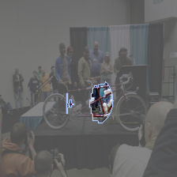

# Contrastive Explanations

This page describes **contrastive** explanations. These are *necessary* and *sufficient* explanations. 
A normal explanation from ReX is only sufficient.

From the command line, the basic call is

```bash
rex <image> --script pytorch.py --contrastive
```

## Example

This image is a tandem bike

```{image} ../assets/tandem.jpg
:alt: Tandem Bike
:align: center
```
<!---->

If we run

```bash
rex tandem.jpg --script ../tests/scripts/pytorch_resnet50.py --vv --output tandem_exp.png
```

we get

```{image} ../assets/tandem_exp.png
:alt: Tandem Bike Explanation
:scale: 200%
:align: center
```
 
<!---->

Passing the highlighted pixels to the model, against the baseline defined in `rex.toml`, is enough to get the classification `tandem`.
However, if we remove these highlighted pixels and leave the rest alone, we still get `tandem`. Why is that? Because these pixels are *sufficient*
to get `tandem`, but they aren't *necessary*. There must be at least one more, independent, explanation for `tandem` in the image. 

We can try to find other sufficient explanations using `--multi`. 

```bash
rex tandem.jpg --script ../tests/scripts/pytorch_resnet50.py --multi --vv --output tandem_exp.png
```




Each one of these is, by itself, sufficient for `tandem`. By default, `contrastive` uses combinations from the set of found sufficient explanations to 
find a combinations which is also *necessary*: if we remove these pixels then we no longer have a `tandem`, if we have only these pixels, we have `tandem`.
This explanations is both sufficient to get `tandem` and necessary to get `tandem`.

```{image} ../assets/tandem_contrastive.png
:alt: Tandem Bike Contrastive Explanation
:scale: 200%
:align: center
```

## Notes

`contrastive` uses multiple explanations under the hood and then tests all combinations of discovered explanations. As a result, it can fail to find a contrastive explanation,
especially if there are more sufficient explanations than discovered by `--multi`. In this case, ReX quits with an error message.

`constrastive` takes an optional `int` at the command line, indicating how many spotlights to launch. This defaults to `10`, just like with multiple explanations.

The constrastive algorithm is an instance of the [set packing](https://en.wikipedia.org/wiki/Set_packing) problem. As such, in the worst case scenario, it can be quite expensive to compute. 

