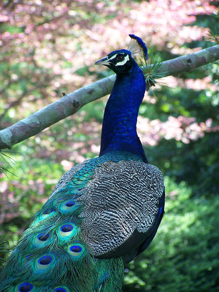
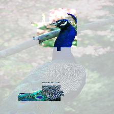
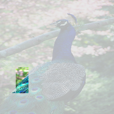
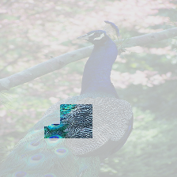
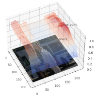
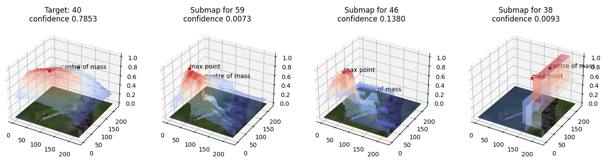

# ReX: Causal Responsibility Explanations for image classifiers

**ReX** is a causal explainability tool for image classifiers.
ReX is black-box, that is, agnostic to the internal structure of the classifier.
We assume that we can modify the inputs and send them to the classifier, observing the output.
ReX provides sufficient, minimal single explanations, non-contiguous explanations (for partially obscured images), multiple explanations
and contrastive explanations (sufficient, necessary and minimal).

```{image} ../assets/rex-structure-600x129.png
:alt: ReX organisation
:width: 600px
:align: center
```

For more information and links to the papers, see the [background](background) page.

```{include} ../README.md
:start-after: <!--inclusion-marker-start-do-not-remove-->
:end-before: <!--inclusion-marker-end-do-not-remove-->
```

## Quickstart

ReX requires as input an image and a model.
ReX natively understands onnx files. Train or download a model (e.g. [Resnet50](https://github.com/onnx/models/blob/main/validated/vision/classification/resnet/model/resnet50-v1-7.onnx)) and, from this directory, run:

```bash
rex tests/test_data/dog.jpg --model resnet50-v1-7.onnx -vv --output dog_exp.jpg
```

To view an interactive plot for the responsibility map, run::

```bash
rex tests/test_data/dog.jpg --model resnet50-v1-7.onnx -vv --surface
```

To save the extracted explanation to a file:

```bash
rex tests/test_data/dog.jpg --model resnet50-v1-7.onnx --output dog_exp.jpg
```

ReX also works with PyTorch, but you will need to write some custom code to provide ReX with the prediction function and model shape, as well as preprocess the input data.
See the sample scripts in `tests/scripts/`.

```bash
rex tests/test_data/dog.jpg --script tests/scripts/pytorch_resnet50.py -vv --output dog_exp.jpg
```

Other options:

```bash
# with spatial search rather than the default global search
rex <path_to_image> --model <path_to_model> --strategy spatial

# to run multiple explanations
rex <path_to_image> --model <path_to_model> --multi

# to view a responsibility landscape heatmap
rex <path_to_image> --model <path_to_model>  --heatmap

# to save a responsibility landscape surface plot
rex <path_to_image> --model <path_to_model>  --surface <path_and_extension>
```

ReX configuration is mainly handled via a config file; some options can also be set on the command line.
ReX looks for the config file `rex.toml` in the current working directory and then `$HOME/.config/rex.toml` on unix-like systems.

If you want to use a custom location, use:

```bash
rex <path_to_image> --model <path_to_model> --config <path_to_config>
```

An example config file is included in the repo as `example.rex.toml`.
Rename this to `rex.toml` if you wish to use it.

## Command line usage

```{include} command_line.md
:start-after: <!--inclusion-marker-start-do-not-remove-->
:end-before: <!--inclusion-marker-end-do-not-remove-->
```

## Examples

### Explanation

An explanation for a ladybird. This explanation was produced with 20 iterations, using the default masking colour (0). The minimal, sufficient explanation itself
is pretty printed using the settings in `[rex.visual]` in `rex.toml`.

  

Setting `raw = true` in `rex.toml` produces the image which was actually classified by the model.


### Multiple Explanations

```bash
rex tests/test_data/peacock.jpg --model resnet50-v1-7.onnx --strategy multi --output peacock.png
```

The number of explanations found depends on the model and some of the settings in `rex.toml`.

{w=200px}   

### Occluded Images





### Explanation Quality

```bash
rex tests/test_data/ladybird.jpg --script tests/scripts/pytorch_resnet50.py --analyse

INFO:ReX:area 0.000399, entropy difference 6.751189, insertion curve 0.964960, deletion curve 0.046096
```

<!--### Submaps-->
<!---->
<!--```bash-->
<!--rex tests/test_data/lizard.jpg --model resnet50-v1-7.onnx --predictions 5 --surface lizard_subs.png-->
<!--```-->
<!---->
<!---->
<!---->
<!---->
<!---->
<!--```{toctree}-->
<!--:maxdepth: 2-->
<!--:caption: Contents:-->
<!---->
<!--background.md-->
<!--command_line.md-->
<!--config.md-->
<!--```-->
