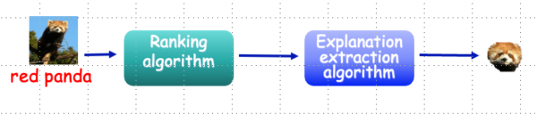

.. ReX documentation master file, created by
   sphinx-quickstart on Fri Sep 27 12:09:33 2024.
   You can adapt this file completely to your liking, but it should at least
   contain the root `toctree` directive.

ReX: Causal Responsibility Explanations for image classifiers
=================

**ReX** is a causal explainability tool for image classifiers.
ReX is black-box, that is, agnostic to the internal structure of the classifier.
We assume that we can modify the inputs and send them to the classifier, observing the output.
ReX outperforms other tools on single explanations, non-contiguous explanations (for partially obscured images), and multiple explanations.

For more information and links to the papers, see the :doc:`background` page.

.. include:: ../README.md
   :parser: myst_parser.sphinx_
   :start-after: <!--inclusion-marker-start-do-not-remove-->
   :end-before: <!--inclusion-marker-end-do-not-remove-->

.. toctree::
   :maxdepth: 2
   :caption: Contents:

   background.md
   command_line.md
   config.md
   scripts.md
